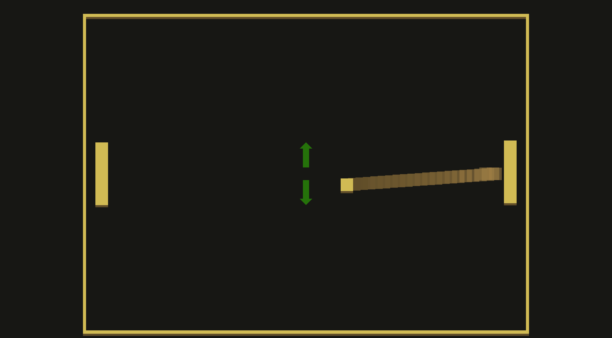

# (TODO: your game's title)

Author: Pengtao Ni

Design: The paddle is controlled by up and down keys, which are being swapped every few seconds.

Screen Shot:

How To Play:

When the arrows in the middle are green, the up key moves the paddle up and the down key moves the paddle down.
When the arrows in the middle are red, the up key moves the paddle down and the down key moves the paddle up.

This game was built with [NEST](NEST.md).
